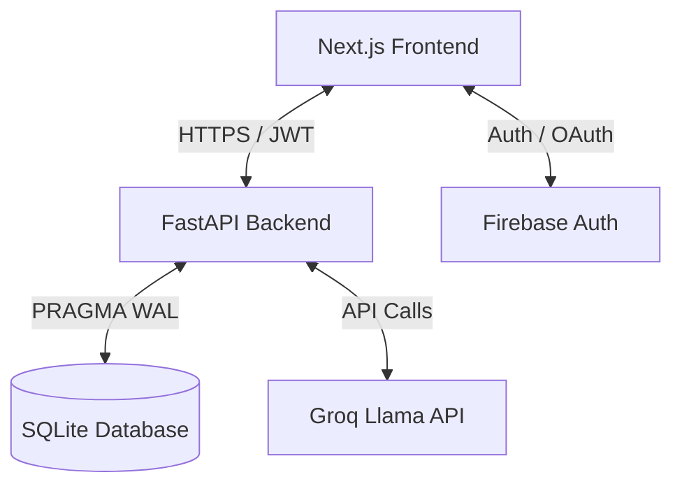

# TÀI LIỆU KIẾN TRÚC VÀ HẠ TẦNG DUOMATH
*Cập nhật: Tháng 6, 2026*

DuoMath là nền tảng học Toán song ngữ Anh - Việt đột phá dành cho học sinh THPT (Lớp 10 - 12). Hệ thống tích hợp các bài học chuẩn hóa, đấu hạng Toán học thời gian thực (Math Ranking Matches - MRM), diễn đàn thảo luận (Bilingual Math Forum - BMF), và gia sư ảo AI chatbot thông minh.

Tài liệu này mô tả chi tiết các công nghệ, hạ tầng, thiết kế và các mẫu kiến trúc (design patterns) đang được áp dụng trong dự án.

---

## 1. Tổng Quan Kiến Trúc Hệ Thống

DuoMath được thiết kế theo mô hình **Client-Server** hiện đại tách biệt hoàn toàn giữa Frontend (giao diện người dùng) và Backend (API xử lý logic & cơ sở dữ liệu).

---

## 2. Frontend (Công Nghệ & Thiết Kế Giao Diện)

Thư mục: `duosteam/frontend`

### A. Công nghệ cốt lõi
*   **Next.js (v16.1.6) & React 19**: Sử dụng mô hình **App Router** (`src/app`) tối ưu cho việc render phía máy chủ (SSR), tối ưu hóa SEO và quản lý route theo thư mục.
*   **Tailwind CSS (v4)**: Sử dụng các tính năng mới nhất của Tailwind v4 (`@tailwindcss/postcss`) để tối ưu hóa hiệu năng biên dịch CSS và tạo ra các tiện ích tiện lợi.
*   **Vanilla CSS (`globals.css`)**: Chứa hệ thống token màu sắc (`--background`, `--foreground`), định nghĩa các lớp phủ chuyển động (floating shapes, glow rings, custom keyframes) và cấu hình View Transitions.

### B. Trải nghiệm người dùng (UX) & Thiết kế Premium
*   **Giao diện Glassmorphism**: Sử dụng độ mờ đục của background kết hợp hiệu ứng kính nhòe (`backdropFilter: "blur(20px)"`), viền mảnh phát sáng nhẹ để mang lại cảm giác hiện đại và cao cấp.
*   **Hiệu ứng Background Động**:
    *   Hệ thống background sử dụng dải màu gradient nước biển sâu sắc nét thay thế cho nền tối đơn điệu.
    *   Sự kết hợp của lưới chấm mảnh (`dot grid pattern`) cùng hơn 15 hình học chuyển động ngẫu nhiên (tròn, lục giác, ngũ giác, hình thoi, chữ thập) tạo chiều sâu và kích thích thị giác.
*   **Cơ chế Chuyển Trang (Page Transitions)**:
    *   **CSS View Transitions API**: Tận dụng tính năng gốc của trình duyệt để chụp lại trạng thái trang cũ và chuyển tiếp sang trang mới một cách mượt mà thông qua thuộc tính `:root { view-transition-name: none; }` và các keyframes `vt-slide-in`, `vt-slide-out`.
    *   **PageTransition Component**: Bộ điều khiển trạng thái (State Machine) bằng React: `visible ➜ exiting ➜ entering ➜ visible`. Component tự động phát hiện thay đổi route và áp dụng hiệu ứng trượt nhẹ kết hợp fade-out/fade-in mà không bị giật hay flash nội dung cũ.
*   **Hiển thị Toán học**: Tích hợp **KaTeX (v0.17.0)** để biên dịch các biểu thức toán học LaTeX từ API thành các ký tự toán học vector sắc nét trên tất cả các thiết bị.
*   **Thư viện Component**: Sử dụng **HeroUI (`@heroui/react` v2.8.10)** cung cấp các nút bấm premium, input, modal và các thành phần giao diện được chuẩn hóa.

### C. Quản lý trạng thái & Authentication
*   **Context Providers**:
    *   `AuthProvider`: Quản lý phiên đăng nhập của người dùng, lưu giữ token JWT và thông tin profile cơ bản.
    *   `MathMapStoreProvider`: Lưu giữ trạng thái bản đồ học tập và lộ trình học tập của học sinh.
*   **Cơ chế xác thực kép (Firebase + Local JWT)**:
    *   Cho phép người dùng đăng nhập bằng tài khoản email/mật khẩu truyền thống hoặc đăng nhập nhanh qua Firebase (Google, Facebook).
    *   Token Firebase sau đó được gửi lên server qua endpoint `/api/firebase-sync` để đồng bộ và phát hành JWT nội bộ phục vụ cho các request API tiếp theo.

---

## 3. Backend (API & Trí Tuệ Nhân Tạo)

Thư mục: `duosteam/backend`

### A. Công nghệ máy chủ
*   **FastAPI (Python 3.12)**: Được lựa chọn thay thế cho Flask nhờ khả năng xử lý bất đồng bộ (`async/await`) hiệu quả cao, tự động sinh tài liệu Swagger và kiểm tra kiểu dữ liệu nghiêm ngặt.
*   **Uvicorn**: ASGI server chạy backend bất đồng bộ hiệu năng cao trong môi trường production.
*   **Gzip Compression**: Tự động nén tất cả phản hồi HTTP có dung lượng trên 500 bytes để tiết kiệm băng thông và tăng tốc độ tải trang.

### B. Cơ sở dữ liệu (SQLite)
*   Sử dụng **SQLite** (`duomath.db`) làm cơ sở dữ liệu lưu trữ cục bộ.
*   **Tối ưu hóa ghi/đọc**:
    *   Bật chế độ **Write-Ahead Logging (WAL)**: `PRAGMA journal_mode=WAL` giúp cho các tiến trình đọc không bị khóa khi có tiến trình ghi.
    *   Tăng tốc độ ghi với `PRAGMA synchronous=NORMAL`.
    *   Tận dụng bộ nhớ đệm RAM lớn hơn `PRAGMA cache_size=-8000` (khoảng 8MB) và lưu trữ tệp tạm thời trong RAM (`PRAGMA temp_store=MEMORY`).
    *   Thiết lập các chỉ mục (`INDEX`) như `idx_test_user` và `idx_game_user` để tăng tốc độ truy vấn lịch sử làm bài.

### C. Công nghệ AI & RAG (Retrieval-Augmented Generation)
Gia sư AI Chatbot hỗ trợ học sinh giải toán THPT thông qua các công nghệ:
*   **Groq API**: Gọi mô hình Llama siêu nhanh với độ trễ cực thấp để phản hồi học sinh theo thời gian thực.
*   **LightRAG-style Knowledge Graph**:
    *   Backend duy trì một bản đồ tri thức toán học tĩnh (`MATH_CONCEPT_GRAPH`) chứa thông tin chi tiết về các khái niệm toán học THPT (Phương trình bậc hai, hệ thức Vi-ét, Delta, Đạo hàm, Cực trị, Tích phân, Giới hạn, Tiệm cận) bao gồm định nghĩa, công thức LaTeX và ví dụ.
    *   Khi học sinh hỏi bài, thuật toán `retrieve_math_context` sẽ phân tích từ khóa và thực thể toán học từ câu hỏi để kéo ngữ cảnh tương quan từ Graph chèn vào Prompt hệ thống (System Prompt). Việc này giúp AI không bao giờ trả lời sai công thức toán cơ bản.
*   **Xử lý hình ảnh bài tập (Vision RAG)**:
    *   Do Render Free tier giới hạn RAM ở mức 512MB, thư viện `easyocr` (đòi hỏi nạp model nặng 1.5GB vào RAM) đã bị loại bỏ khỏi môi trường production.
    *   Hệ thống chuyển đổi trực tiếp hình ảnh bài tập do học sinh upload sang định dạng Base64 và gửi lên các mô hình Vision LLM của Groq để nhận diện và giải quyết bài toán trực tiếp qua mắt nhìn của AI.

---

## 4. Hạ Tầng Triển Khai (Infrastructure & Deployment)

### A. Deploy Frontend
*   Triển khai trên các nền tảng đám mây tối ưu cho Next.js (Vercel/Netlify).
*   Tự động xây dựng lại dự án (CI/CD) thông qua Git webhook khi có code mới được đẩy lên nhánh chính.

### B. Deploy Backend (Render Web Service)
*   **Dịch vụ**: Được triển khai dưới dạng một dịch vụ Web Service trên Render (`duomath-api`).
*   **Quản lý cấu hình (`render.yaml`)**:
    *   **Start Command**: `uvicorn main:app --host 0.0.0.0 --port $PORT --workers 2` (Sử dụng 2 worker threads bất đồng bộ).
    *   **Python Version**: Đóng băng ở phiên bản `"3.12"`.
    *   **Tối ưu hóa tài nguyên RAM**: Thiết lập biến môi trường `MALLOC_ARENA_MAX=2` để hạn chế cấp phát bộ nhớ dư thừa trong ngôn ngữ C/Python, ngăn ngừa lỗi tràn bộ nhớ (Out-Of-Memory) trên gói Render Free.
*   **Cơ chế Chống Ngủ Đông (Keep-alive)**:
    *   Do gói miễn phí của Render tự động tắt (sleep) dịch vụ nếu không có request sau 15 phút, backend chạy một tiến trình ngầm bất đồng bộ (`_keep_alive()`) tự động ping chính nó qua endpoint `/api/health` mỗi 14 phút một lần khi có biến môi trường `SELF_URL`. Điều này giữ cho server luôn ở trạng thái sẵn sàng phục vụ học sinh ngay lập tức.
