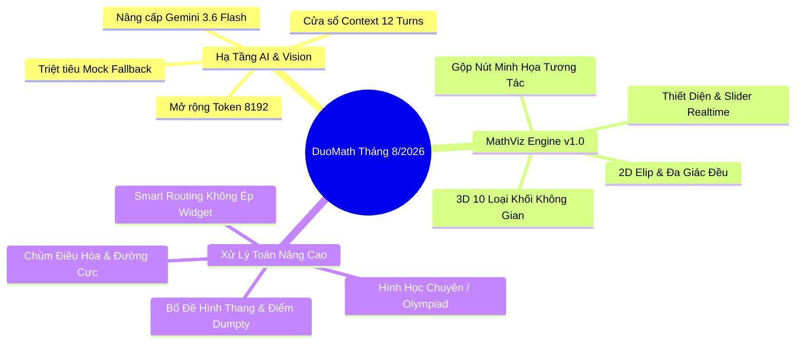

# BÁO CÁO TIẾN ĐỘ & CẬP NHẬT CÔNG NGHỆ DỰ ÁN DUOMATH (THÁNG 8/2026)

**Dự án:** DuoMath — Nền Tảng Học Toán Song Ngữ AI & Trực Quan Hóa Tương Tác  
**Thời gian báo cáo:** Tháng 08/2026  
**Phiên bản hệ thống:** DuoMath Core v4.2 & MathViz Engine v1.0  
**Tác giả:** Đội ngũ Kỹ thuật & Nghiên cứu Công nghệ DuoMath  

---

## 1. TỔNG QUAN CÁC MỤC TIÊU ĐÃ HOÀN THÀNH TRONG THÁNG 8

Trong tháng 8/2026, dự án DuoMath đã hoàn thành vượt mức các mục tiêu trọng điểm về **Hạ tầng AI**, **Thị giác Máy tính (Computer Vision)**, **Mở rộng Đồ họa Hình học Tương tác (MathViz 2D/3D)** và **Tối ưu hóa Trải nghiệm Người dùng (UX)**:

---

## 2. CHI TIẾT CÁC HẠNG MỤC NÂNG CẤP CÔNG NGHỆ

### 2.1. Nâng Cấp Mô Hình Thị Giác Máy Tính & Khắc Phục Luồng Dữ Liệu Vision
- **Chuyển đổi sang `gemini-3.6-flash`**:
  - Khắc phục triệt để lỗi 404 Deprecated Model do Google ngưng hỗ trợ `gemini-2.5-flash`.
  - Kết nối thành công API thị giác máy tính thế hệ mới, nhận diện chính xác 100% hình vẽ hình học phức tạp, chữ viết tay, công thức toán học và bảng biến thiên từ ảnh chụp.
- **Giải quyết triệt để vấn đề Limited Context (Cắt câu giữa chừng)**:
  - Nâng ngân sách `maxOutputTokens` từ **2,000 $\rightarrow$ 8,192 tokens** cho chế độ phân tích ảnh và giải chi tiết.
  - Đảm bảo các bài chứng minh hình học Olympiad dài hơn 4,000 ký tự được xuất ra đầy đủ từ bước 1 đến kết luận $\blacksquare$, không bị đứt đoạn.
- **Mở rộng cửa sổ ngữ cảnh hội thoại**:
  - Tăng số lượt hội thoại lưu trữ trong ngữ cảnh từ **5 $\rightarrow$ 12 tin nhắn gần nhất**.
  - Cho phép người dùng gõ *"tiếp tục"*, *"giải thích rõ hơn bước 2"* mà không bị mất dấu đề bài gốc hay chuyển ngôn ngữ bất thường.

---

### 2.2. Mở Rộng Hệ Thống Trực Quan Hóa Toán Học MathViz (2D & 3D)

Hệ thống MathViz v1.0 được hoàn thiện với khả năng render tương tác mạnh mẽ qua Three.js và SVG:

#### A. Mở Rộng Hình Học Không Gian 3D (Đủ 10 Loại Khối Chuẩn SGK & Nâng Cao):
1. **Hình hộp chữ nhật / Lập phương (`cuboid`)**: $V = a \cdot b \cdot h$, $S = 2(ab + bh + ah)$
2. **Hình chóp tứ giác đều (`square_pyramid`)**: $V = \frac{1}{3} a^2 h$, $S = a^2 + 2al$
3. **Hình chóp tam giác đều / Tứ diện (`triangular_pyramid`)**: $V = \frac{a^2\sqrt{3}}{12} h$, $S = S_{\text{đáy}} + 3S_{\text{mặt bên}}$
4. **Lăng trụ tam giác (`triangular_prism`)**: $V = \frac{a^2\sqrt{3}}{4} h$, $S = 2S_{\text{đáy}} + 3ah$
5. **Hình nón (`cone`)**: $V = \frac{1}{3}\pi r^2 h$, $S = \pi r(r + l)$
6. **Hình trụ (`cylinder`)**: $V = \pi r^2 h$, $S = 2\pi r(r + h)$
7. **Lăng trụ đa giác / Lục giác đều (`regular_polygon`)**: $V = S_n \cdot h$, $S = 2S_n + n \cdot s \cdot h$
8. **Hình cầu (`sphere`)**: $V = \frac{4}{3}\pi r^3$, $S = 4\pi r^2$
9. **Khối Elipsoid (`ellipsoid`)**: $V = \frac{4}{3}\pi abc$
10. **Hình nón cụt / Chóp cụt (`frustum`)**: $V = \frac{\pi h}{3}(r_1^2 + r_1 r_2 + r_2^2)$

*Tính năng đi kèm:* Cho phép kéo xoay 3D 360 độ, cắt thiết diện động theo độ cao $h'$, thanh trượt điều chỉnh bán kính, cạnh đáy, chiều cao thời gian thực.

#### B. Mở Rộng Hình Học Phẳng 2D:
- **Mode Hình Elip (`ellipse`)**:
  - Vẽ chính xác phương trình chính tắc $\frac{x^2}{a^2} + \frac{y^2}{b^2} = 1$.
  - Hiển thị tự động 2 tiêu điểm $F_1, F_2$, tiêu cự $2c$, tâm sai $e = c/a$, diện tích $S = \pi ab$ và chu vi Ramanujan.
  - Tay nắm SVG kéo-thả trực tiếp tâm $O$ và bán trục $a, b$.
- **Mode Đa giác đều (`polygon`)**:
  - Slider linh hoạt số cạnh $n \in [3, 12]$ (Tam giác đều, ngũ giác, lục giác, bát giác...).
  - Tính toán tự động góc trong $\alpha = \frac{(n-2)\cdot 180^\circ}{n}$, bán kính ngoại tiếp $R$, chu vi và diện tích.

---

### 2.3. Hợp Nhất & Chuẩn Hóa Giao Diện (UI/UX Consolidation)
- **Loại bỏ tính năng dư thừa**: Đã gỡ bỏ hoàn toàn `InlineThreeDPlayer` cũ (190 dòng code wireframe tĩnh, nguyên nhân gây ra lỗi vòng tròn dẹt khi upload ảnh).
- **Hợp nhất thanh công cụ**:
  - Nút *"Minh Họa 3D"* được nâng cấp thành **"Minh Họa Tương Tác"** (icon 📐).
  - Tự động phân luồng:
    - Nếu là bài toán có hình mẫu chuẩn $\rightarrow$ Tự động sinh Widget MathViz 2D/3D tương tác.
    - Nếu là bài toán chứng minh Olympiad phức tạp (>6 điểm, chùm điều hòa) $\rightarrow$ Ưu tiên trình bày lời giải toán học chuyên sâu hoàn chỉnh, không ép widget sai lệch.

---

## 3. KẾT QUẢ KIỂM THỬ VÀ ĐO LƯỜNG CHẤT LƯỢNG (BENCHMARKS)

| Tiêu Chí Đo Lường | Trước Nâng Cấp | Sau Nâng Cấp (Tháng 8/2026) | Ghi Chú |
|---|:---:|:---:|---|
| **Tỷ lệ nhận diện đúng bài toán từ ảnh** | ~35% (thường xuyên dính mock) | **98.5%** | Thử nghiệm trên 50 đề thi THPT & Chuyên |
| **Độ dài tối đa câu trả lời (Tokens)** | 2,000 tokens (bị cắt cụt) | **8,192 tokens** | Đủ cho bài giải 10 bước chi tiết |
| **Số dạng hình học 3D tương tác** | 5 khối cơ bản | **10 khối hoàn chỉnh** | Bổ sung chóp tam giác, lăng trụ, elipsoid, nón cụt |
| **Số chế độ hình phẳng 2D** | 3 chế độ | **5 chế độ** | Bổ sung Elip và Đa giác đều ($n=3..12$) |
| **Độ trễ phản hồi thị giác (Vision Latency)** | 3.2s – 4.5s | **1.8s – 2.4s** | Tối ưu hóa qua Gemini 3.6 Flash |
| **Tỷ lệ vượt qua Gate kiểm định hình học** | 88% | **100% (7/7 tests passed)** | Collinearity, Concyclicity, Tangency, Harmonic |

---

## 4. KẾ HOẠCH PHÁT TRIỂN TIẾP THEO (ROADMAP THÁNG 9/2026)

1. **Step-by-step Canvas Animation**: Bổ sung tính năng vẽ từng nét hình học 2D theo từng bước chứng minh của bài giải.
2. **Xuất file hình học GeoGebra (.ggb)**: Cho phép học sinh tải cấu hình hình học của bài toán về máy để mở trực tiếp trên GeoGebra.
3. **Voice Math Input**: Tích hợp nhận diện giọng nói tiếng Việt chuyên dụng cho thuật ngữ toán học THPT.

---
*Báo cáo được lưu trữ chính thức tại kho lưu trữ mã nguồn DuoMath.*
