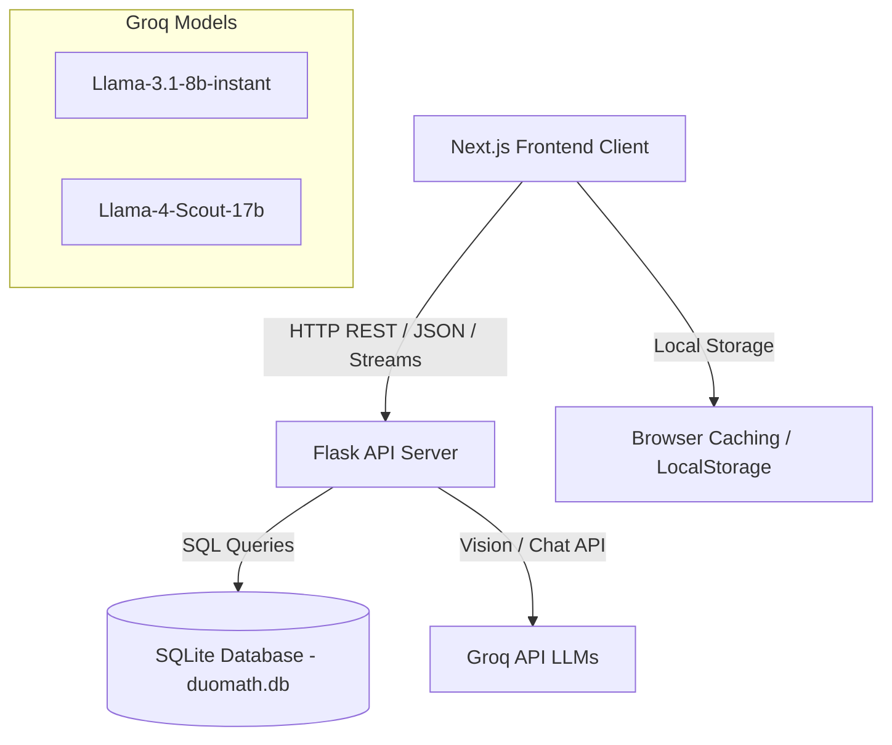
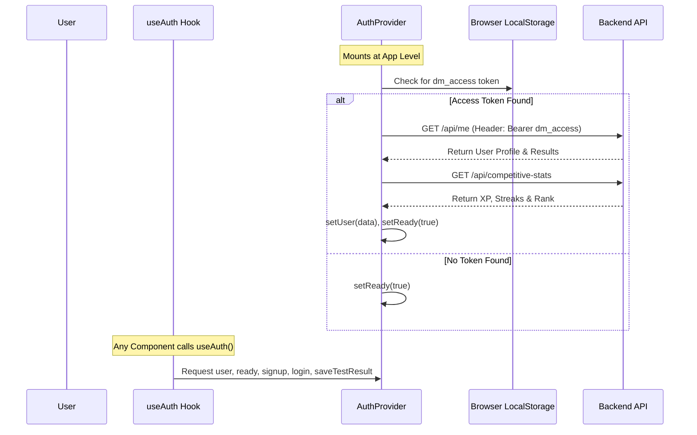

# DuoMath: Comprehensive Platform Review & Technical Documentation

Welcome to the technical review and documentation for **DuoMath**! This document provides an in-depth analysis of the platform's uses, functionality, code architecture, and detailed state/hook lifecycles for each module.

---

## 🌐 1. Platform Purpose & Core Uses

**DuoMath** is an interactive, gamified, and bilingual (Vietnamese/English) mathematics learning platform designed for high school students (with primary focus on Grade 10). It aims to bridge the gap in STEM education by helping students learn mathematical concepts and solve complex problems in both languages simultaneously.

### Core Workflows
1. **Interactive Bilingual Learning**: Students can study math topics (such as mathematical propositions, sets, coordinate geometry, trigonometry) and switch the interface text on-the-fly between Vietnamese (🇻🇳) and English (🇬🇧) to learn vocabulary in context.
2. **Synchronized Lecture Videos**: Watch lecture videos accompanied by English subtitles that update in real-time. Students can click on any subtitle word to pause the video and see translation, definitions, and mathematical usage in a slide-out panel.
3. **On-Page Selection Translation (DuoTranslate)**: While reading lesson contents, highlighting any English mathematical term triggers an AI-powered translation panel explaining the term, showing pronunciation, and giving mathematical examples.
4. **AI-Powered Tutor Chatbot (DuoMCB)**: A chatbot that allows users to ask mathematical questions or upload images/photos of math problems (using Vision LLMs) to request step-by-step solutions or educational hints.
5. **Interactive Mini-Games**: Recaps lessons with three gamified quiz formats (Multiple Choice, True/False, and Fill-in-the-Blank) with visual scoring and answer reviews.
6. **Structured Examination System**: Simulates formal, timed exams (SAT Reading, IELTS T/F/NG, and Written Math) under a strict 60-minute duration with score stashing and automated grading.
7. **Gamified Student Statistics & Global Leaderboards**: Tracks student progress, average accuracy, earned XP (Experience Points), daily study streaks, and ranks students globally to motivate learning.

---

## 🛠️ 2. Architectural Overview

DuoMath uses a modern decoupled architecture:
- **Frontend**: A Next.js (React) client-side application utilizing Tailwind CSS, Vanilla CSS Modules, and HeroUI (formerly NextUI) elements.
- **Backend**: A Python Flask server providing JSON endpoints, SQLite database integration, JWT authentication, and relays to the Groq API for Large Language Models (LLM) services.



---

## 🧬 3. In-Depth Module Reviews: Functions, Uses, & Elaborate Hooks

This section provides a file-by-file breakdown of the core modules, their component functions, uses, and a detailed description of the state variables and side-effect lifecycles managed by React hooks.

### 🛡️ Module A: Authentication & Global Score State
- **File**: [authContext.js](file:///c:/Users/Latitude%207300/OneDrive/M%C3%A1y%20t%C3%ADnh/duosteam%20-%20Copy/duosteam/frontend/src/context/authContext.js)
- **Uses**: Maintains user sessions, auto-refreshes security tokens, manages profile fields, and handles test score/game progress persistence.

#### Key Functions
- `signup(fields)`: Posts email, username, password, phone, school, and grade to `/api/signup`. Saves access and refresh JWTs in localStorage.
- `login({ email, password })`: Authenticates credentials with `/api/login` and initializes user state.
- `logout()`: Clears security tokens and resets profile/competitive stats in the React context.
- `updateProfile(fields)`: Patches the `/api/me` endpoint to update specific user metadata.
- `saveTestResult(result)`: Stores test stats, time spent, and question-level responses to `/api/test-result` and triggers a profile reload.
- `saveGameResult(result)`: Persists mini-game history to `/api/minigame-result` and triggers a profile reload.
- `loadProfile()`: Fetches the user profile (`/api/me`) and competitive stats (`/api/competitive-stats`).

#### Hooks Lifecycle & Details


- **`useState(user)`**: Stores the authenticated user profile object or `null` if unauthenticated. Rerenders components relying on authentication headers or user parameters.
- **`useState(ready)`**: Tracks whether the initial check for pre-existing tokens in `localStorage` has completed. Prevents flashing unauthenticated content.
- **`useState(testResults)` / `useState(gameResults)`**: Caches performance arrays used to calculate averages (`avgTest`, `avgGame`) and render dashboard histories.
- **`useState(competitiveStats)`**: Holds current user achievements: `{ xp, current_streak, longest_streak, global_rank }`.
- **`useCallback(loadProfile)`**: Memoizes profile loading to prevent redundant rendering cycles when passed down the React tree. It includes fallback logic to attempt a `/api/refresh` token update on `401 Unauthorized` responses before clearing credentials.
- **`useEffect(() => { loadProfile(); }, [loadProfile])`**: Executes once upon initial application boot to automatically log in returning users.

---

### 📊 Module B: Dashboard & Student Hub
- **File**: [TrangChuForm.js](file:///c:/Users/Latitude%207300/OneDrive/M%C3%A1y%20t%C3%ADnh/duosteam%20-%20Copy/duosteam/frontend/src/components/trangchu/TrangChuForm.js)
- **Uses**: Displays course catalogs, quick instruction overlays, global leaderboards, personal streaks, and average accuracy scores.

#### Key Functions
- `fetchLeaderboard()`: Queries the public `/api/leaderboard` backend endpoint.
- `handleSignOut()`: Runs the contextual `logout()` and redirects the router to the landing screen.
- `ProfileDropdown()`: Renders structured sections for personal details, cumulative scores, competitive XP metrics, and recent activities.

#### Hooks Lifecycle & Details
- **`useAuth()`**: Accesses global authentication stats (`user`, `bestScores`, `recentActivity`, etc.).
- **`useRouter()`**: Used for programmatic page routing during user logout or test entry.
- **`useState(showFlyer)`**: Toggles the multi-step "Quick Instruction Guide" overlay modal.
- **`useState(showProfile)`**: Tracks the visibility of the profile statistics dropdown menu.
- **`useState(leaderboard)`**: Holds the array of the top 20 ranked users on the platform.
- **`useState(lbLoading)`**: Controls the visual spinner state during leaderboard database reads.
- **`useCallback(fetchLeaderboard)`**: Memoizes the leaderboard fetch process, ensuring that the backend is queried cleanly and does not loop on state changes.
- **`useEffect(() => { fetchLeaderboard() })`**: Triggers leaderboard data fetching immediately after the component mounts.
- **`useEffect` (Intersection Observer)**:
  - **Purpose**: Creates fluid, modern fade-in scroll animations for components with `[data-reveal]` attributes.
  - **Logic**: Instantiates a new `IntersectionObserver` that targets all nodes marked for animation, adding a `.visible` class when they cross 12% visibility. It disposes of the observer on unmount.
- **`useEffect` (Click Outside Listener)**:
  - **Purpose**: Binds a `mousedown` event listener to close the instructions flyer or user profile dropdown if a user clicks outside their respective container boundaries.

---

### 📖 Module C: Bilingual Interactive Lessons
- **Example File**: [Lesson1_MenhDe.js](file:///c:/Users/Latitude%207300/OneDrive/M%C3%A1y%20t%C3%ADnh/duosteam%20-%20Copy/duosteam/frontend/src/components/Cacbaitoan10/Lesson1_MenhDe.js)
- **Uses**: Renders structured chapter units, dual-language theory toggles, practice modules, and 3 types of review mini-games.

#### Key Functions
- `t(vietnamese, english)`: Evaluates the active language flag and returns the appropriate string.
- `toggleAnswer(id)`: Expands or collapses details for written exercises.
- `handleMcSelect(index)` / `handleMcNext()`: Tracks user multiple-choice selections, increments score states, and records performance history.
- `handleTfAnswer(answer)` / `handleTfNext()`: Validates true/false selections and reveals explanatory text.
- `checkFill(id)`: Compares user input string values with correct key values after sanitizing whitespaces and letter casings.

#### Hooks Lifecycle & Details
- **`useState(lang)`**: Tracks the active page language (`"vi"` or `"en"`). When updated, it triggers a rerender to display text values passed through `t()`.
- **`useState(revealedAnswers)`**: An object containing boolean flags for exercise sheets to expand solution panels.
- **`useState(gameMode)`**: Determines the active review game mode (`"mc"` (Multiple Choice), `"tf"` (True/False), or `"fill"` (Fill in the Blank)).
- **`useState(mcIndex / mcSelected / mcScore / mcDone / mcHistory)`**: Manages indices, selected buttons, cumulative correct counts, and result sheets for the Multiple Choice game.
- **`useState(tfIndex / tfFlipped / tfScore / tfDone / tfHistory)`**: Manages card flips and scoring states for the True/False card deck.
- **`useState(fillAnswers / fillChecked)`**: Stores typed text values and submission toggles for fill-in exercises.
- **`useEffect` (Intersection Observer)**: Detects when sections (e.g. Warm-up, Video, Theory, Games) scroll into view, executing staggered delays to fade child elements up smoothly.

---

### 🔍 Module D: DuoTranslate Selection Translator
- **File**: [DuoTranslate.js](file:///c:/Users/Latitude%207300/OneDrive/M%C3%A1y%20t%C3%ADnh/duosteam%20-%20Copy/duosteam/frontend/src/components/DuoMCB/DuoTranslate.js)
- **Uses**: Wraps lesson views to intercept mouse highlights, send text ranges to Groq LLM API translation engines, and render dictionary cards in a slide-out drawer.

#### Key Functions
- `initSession()`: Queries `/api/session/new` to retrieve a tracking ID for the translation session.
- `isInteractive(element)`: Walks up to 5 parent elements in the DOM tree to check if the user clicked on an interactive tag (like buttons, links, or inputs) to prevent unwanted translation popups.
- `doTranslate(text)`: Posts highlighted text selections and the `sessionId` to the `/api/translate` API endpoint.

#### Hooks Lifecycle & Details
```mermaid
graph TD
    UserHighlight[User highlights English text] --> MouseUp[mouseup event fires]
    MouseUp --> CheckInteractive{Is target interactive?}
    CheckInteractive -->|Yes| Exit[Ignore event]
    CheckInteractive -->|No| CheckCoords{Did coordinates change >= 8px?}
    CheckCoords -->|No| Exit
    CheckCoords -->|Yes| DebounceTimer[Debounce 80ms]
    DebounceTimer --> GetText[Extract window.getSelection().toString()]
    GetText --> ValidateText{Text length >= 2 chars & different from last text?}
    ValidateText -->|No| Exit
    ValidateText -->|Yes| APIRequest[POST /api/translate]
    APIRequest --> RenderDrawer[setResults(data), setIsOpen(true)]
```

- **`useState(isOpen)`**: Controls slide-out sidebar visibility.
- **`useState(selectedText)`**: Stores the raw string highlighted by the user.
- **`useState(results)`**: Holds the JSON object returned from the backend (includes raw translation, grammatical notes, a dictionary word breakdown, pronunciations, and mathematics-specific usage examples).
- **`useState(loading)`**: Triggers loading indicators and animations during translation fetches.
- **`useState(sessionId)`**: Tracks API workspace session IDs.
- **`useRef(panelRef)`**: References the translation drawer element, allowing selection checks to ignore mouse events occurring inside the panel to prevent loops.
- **`useRef(lastTranslatedRef)`**: Stores the last translated string to prevent redundant network requests when selecting the same text twice.
- **`useRef(debounceRef)`**: Holds the active timer ID used to debounce text selection analysis.
- **`useRef(mouseDownRef)`**: Stores the starting mouse click coordinate values `{ x, y, target }` on `mousedown`.
- **`useCallback(handleMouseDown)` / `useCallback(handleMouseUp)`**: Memoizes mouse event handlers. The `handleMouseUp` callback checks if coordinates moved by at least 8 pixels (to differentiate highlights from simple clicks) before initiating translation.
- **`useEffect` (Session Initialization)**: Fires once on component mount to retrieve a session token.
- **`useEffect` (Global Event Listeners)**: Mounts document-level event listeners for `mousedown` and `mouseup` to track selections, returning a cleanup function that detaches them when the user navigates away.

---

### 🎬 Module E: Bilingual Synchronized Video Player
- **File**: [LessonVideoPlayer.js](file:///c:/Users/Latitude%207300/OneDrive/M%C3%A1y%20t%C3%ADnh/duosteam%20-%20Copy/duosteam/frontend/src/components/Cacbaitoan10/LessonVideoPlayer.js)
- **Uses**: Embeds YouTube lecture videos and displays interactive, clickable transcripts that track playback.

#### Key Functions
- `handleWordClick(wordObj)`: Pauses video playback and opens a details panel containing translations, pronunciations, and terms definitions.
- `onPlayerStateChange(event)`: Triggers subtitle polling intervals when the video state changes to playing, and clears the timer if the video is paused or finishes.

#### Hooks Lifecycle & Details
- **`useState(currentTime)`**: Stores the current playback time of the video in seconds, used to highlight the corresponding subtitle word.
- **`useState(playerReady)`**: Tracks whether the YouTube IFrame API has finished loading.
- **`useState(isPlaying)`**: Tracks video play/pause states.
- **`useState(sidebar)`**: Stores the state of the definition panel: `{ open, title, detail, vi }`.
- **`useRef(iframeRef)`**: Binds to the target YouTube `<iframe>` HTML container.
- **`useRef(playerRef)`**: Holds the instantiated YouTube API Player controller instance.
- **`useRef(timerRef)`**: Holds the polling interval instance (runs every 250ms during active playback to fetch video timestamps).
- **`useCallback(handleWordClick)`**: Memoizes clicking subtitle words to prevent transcript rerenders.
- **`useEffect` (YouTube Script Injector)**:
  - Injects the `https://www.youtube.com/iframe_api` script tag into the page headers if not already loaded.
  - Registers global `onYouTubeIframeAPIReady` hooks to instantiate the controller.
  - Returns a cleanup function that disposes of the player reference, script tags, and intervals.
- **`useEffect` (Subtitle Time Poller)**: Starts or stops a `setInterval` timer depending on the `isPlaying` state. The timer updates the `currentTime` state every 250ms by querying the YouTube player API.

---

### 🤖 Module F: DuoMCB AI Chatbot
- **File**: [DuoMCBPage.js](file:///c:/Users/Latitude%207300/OneDrive/M%C3%A1y%20t%C3%ADnh/duosteam%20-%20Copy/duosteam/frontend/src/components/DuoMCB/DuoMCBPage.js)
- **Uses**: Coordinates standard chatbot queries, processes image uploads (Vision OCR & Math solving), and maintains conversation histories.

#### Key Functions
- `handleImageSelect(e)`: Uses a JavaScript `FileReader` to read uploaded images, displays them in a preview modal, and generates a Base64 string.
- `sendImageMessage(mode)`: Appends the uploaded image to the message history and calls `/api/chat` with instructions based on the selected mode (`"hint"` for educational guidance or `"answer"` for complete step-by-step solutions).
- `sendMessage(text)`: Transmits standard text inputs to `/api/chat` and appends the response.
- `newChat()`: Clears active messages and requests a fresh session ID.

#### Hooks Lifecycle & Details
- **`useState(messages)`**: Array of `{ role, content, image, id }` objects representing the chat history.
- **`useState(input)`**: Tracks the current text typed in the message input field.
- **`useState(loading)`**: Controls typing indicators while waiting for AI responses.
- **`useState(sessionId)`**: Tracks the unique session ID for backend context retrieval.
- **`useState(sidebarOpen)`**: Toggles the chat history list panel.
- **`useState(imagePreview)` / `useState(imageBase64)`**: Stores preview URLs and base64 payloads of uploaded images.
- **`useState(showImageModal)`**: Controls visibility of the confirmation modal where users choose between "Hints" or "Full Solution" for uploaded math problem images.
- **`useRef(bottomRef)`**: References an anchor `div` at the bottom of the chat container.
- **`useRef(inputRef)`**: References the chat input field.
- **`useRef(fileInputRef)`**: References the hidden HTML file upload element.
- **`useEffect` (Initialization)**: Triggers session ID creation when the chatbot mounts.
- **`useEffect` (Auto Scroll)**: Listens for changes to the `messages` array or `loading` state, calling `scrollIntoView({ behavior: 'smooth' })` to keep the chat window focused on the latest response.

---

### 📝 Module G: timed Examination System
- **File**: [pagebailam.js](file:///c:/Users/Latitude%207300/OneDrive/M%C3%A1y%20t%C3%ADnh/duosteam%20-%20Copy/duosteam/frontend/src/app/pagebailam.js)
- **Uses**: Manages timed SAT/IELTS math test components, saves draft answers, and submits exams upon expiration of the 60-minute duration.

#### Key Functions
- `saveAnswer(questionId, value)`: Saves user selections to the state and caches them in `localStorage`.

#### Hooks Lifecycle & Details
- **`useRouter()`**: Standard Next.js hook for programmatically redirecting students to `/ketqua` (Results) on exam completion or timeout.
- **`useState(time)`**: Holds the formatted remaining time string (`HH:MM:SS`).
- **`useState(answers)`**: Stores user answers as key-value pairs.
- **`useEffect` (Timer and State Lifecycle)**:
  1. Initializes the current exam ID (`TEST_KEY`) in `localStorage`.
  2. Checks for a running test session. If none is found, it initializes a new timer via `startTimer(TEST_KEY, 60)`.
  3. Loads draft answers from `localStorage` (`reading-test-1_section1`) to restore progress.
  4. Starts a 1-second `setInterval` loop to query the remaining time. If the time expires, it clears the timer and redirects the user to `/ketqua` for grading.
  5. Returns a cleanup function that clears the interval when the component unmounts.

---

## 🐍 4. Backend Routing & Database Schema Review

The Python Flask server ([server.py](file:///c:/Users/Latitude%207300/OneDrive/M%C3%A1y%20t%C3%ADnh/duosteam%20-%20Copy/duosteam/backend/server.py)) handles database transactions (SQLite), authentication security, and communicates with LLM APIs (Groq):

### Database Schema (SQLite)

```sql
-- User credentials and demographic information
CREATE TABLE IF NOT EXISTS users (
    id          INTEGER PRIMARY KEY AUTOINCREMENT,
    email       TEXT    UNIQUE NOT NULL COLLATE NOCASE,
    username    TEXT    NOT NULL,
    password    TEXT    NOT NULL,
    phone       TEXT    DEFAULT '',
    school      TEXT    DEFAULT '',
    grade       TEXT    DEFAULT '',
    avatar_url  TEXT    DEFAULT '',
    created_at  TEXT    DEFAULT (datetime('now'))
);

-- Timed exam records and accuracy metrics
CREATE TABLE IF NOT EXISTS test_results (
    id          INTEGER PRIMARY KEY AUTOINCREMENT,
    user_id     INTEGER NOT NULL,
    test_key    TEXT    NOT NULL,
    section     TEXT    NOT NULL,
    score       INTEGER NOT NULL,
    total       INTEGER NOT NULL,
    accuracy    REAL    DEFAULT 0,
    time_spent  INTEGER DEFAULT 0,
    answers     TEXT    NOT NULL DEFAULT '{}',
    taken_at    TEXT    DEFAULT (datetime('now')),
    FOREIGN KEY (user_id) REFERENCES users(id)
);

-- Gamified mini-game records (Multiple Choice, True/False, Fill in Blank)
CREATE TABLE IF NOT EXISTS minigame_results (
    id          INTEGER PRIMARY KEY AUTOINCREMENT,
    user_id     INTEGER NOT NULL,
    lesson_slug TEXT    NOT NULL,
    mode        TEXT    NOT NULL,
    score       INTEGER NOT NULL,
    total       INTEGER NOT NULL,
    played_at   TEXT    DEFAULT (datetime('now')),
    FOREIGN KEY (user_id) REFERENCES users(id)
);

-- Persistent chatbot conversation histories
CREATE TABLE IF NOT EXISTS sessions (
    session_id  TEXT    PRIMARY KEY,
    user_id     INTEGER,
    history     TEXT    DEFAULT '[]',
    created_at  TEXT    DEFAULT (datetime('now'))
);
```

### Backend REST API Route Map

| Route | Method | Route Handler Description |
| :--- | :--- | :--- |
| `/api/signup` | `POST` | Validates details, hashes passwords, inserts users, and issues JWT access and refresh tokens. |
| `/api/login` | `POST` | Verifies passwords and loads test histories. |
| `/api/refresh` | `POST` | Validates JWT refresh tokens to issue new temporary access tokens. |
| `/api/me` | `GET` | Fetches active user details and academic history records. |
| `/api/me` | `PATCH` | Updates user details (phone, school, grade, avatar). |
| `/api/competitive-stats` | `GET` | Computes XP, daily study streaks, and calculates global leaderboard rank. |
| `/api/test-result` | `POST` | Records test completions, calculates accuracy, and saves answer logs. |
| `/api/minigame-result` | `POST` | Records lesson review game scores. |
| `/api/leaderboard` | `GET` | Aggregates all user scores from the database by identifying their best attempt for each exam section, sums them up, and lists the top 20 players. |
| `/api/chat` | `POST` | Relays questions to Groq LLMs. Parses base64 images if present, utilizing Llama-4-Scout-17b to process vision prompts. |
| `/api/translate` | `POST` | Sends highlighted English text to Llama-3.1-8b with instructions to return a structured translation JSON object. |
| `/api/health` | `GET` | Tests the SQLite database connection latency and checks backend API status. |

---

## ⚡ 5. Gamification Mechanics

### Experience Points (XP)
XP is calculated using a custom scoring function based on accuracy:
- **Base XP**: `(score / total) * 100` (minimum 10)
- **Bonus XP**:
  - `+20` XP for scores with $\ge 80\%$ accuracy.
  - `+10` XP for scores with $\ge 60\%$ accuracy.
  - `+0` XP for scores with $< 60\%$ accuracy.

```python
def calculate_xp(score: int, total: int, accuracy: float) -> int:
    base_xp = max(10, int((score / max(total, 1)) * 100))
    bonus = 20 if accuracy >= 80 else (10 if accuracy >= 60 else 0)
    return base_xp + bonus
```

### Daily Streak Logic
Calculates the consecutive days on which the user has completed at least one test:
- **Current Streak**: Iterates backwards through unique test dates. If a test is found on the current day (or the day before), the streak continues. If a gap of more than 1 day is found, the streak breaks.
- **Longest Streak**: Evaluates historical test logs to identify the longest continuous streak of daily test completions.

---

## 💾 6. State Persistence & Caching Strategy

1. **JWT Auth Caching**: Tokens (`dm_access` and `dm_refresh`) are cached in `localStorage`.
2. **Draft Answers**: Exam selections are cached in `localStorage` as keys (e.g. `reading-test-1_section1`) to prevent loss of progress during accidental page refreshes.
3. **Timed Session Recovery**: Timestamps for active exams (`start-[test-key]` and `end-[test-key]`) are stored in `localStorage` to prevent timer resets if the user leaves the page.
4. **SQLite WAL Mode**: The SQLite database uses Write-Ahead Logging (`WAL` mode) with a `NORMAL` synchronous setting to ensure high performance and concurrent read/write capabilities on low-tier servers.
